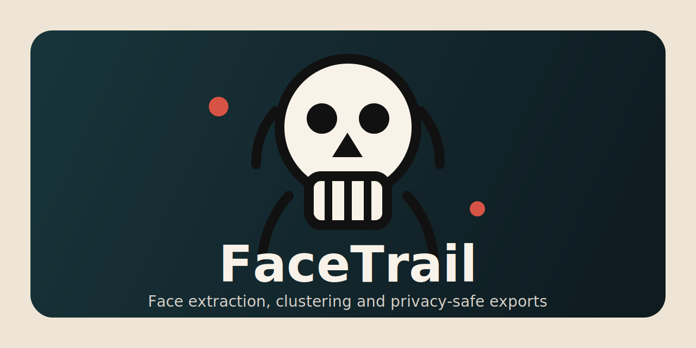
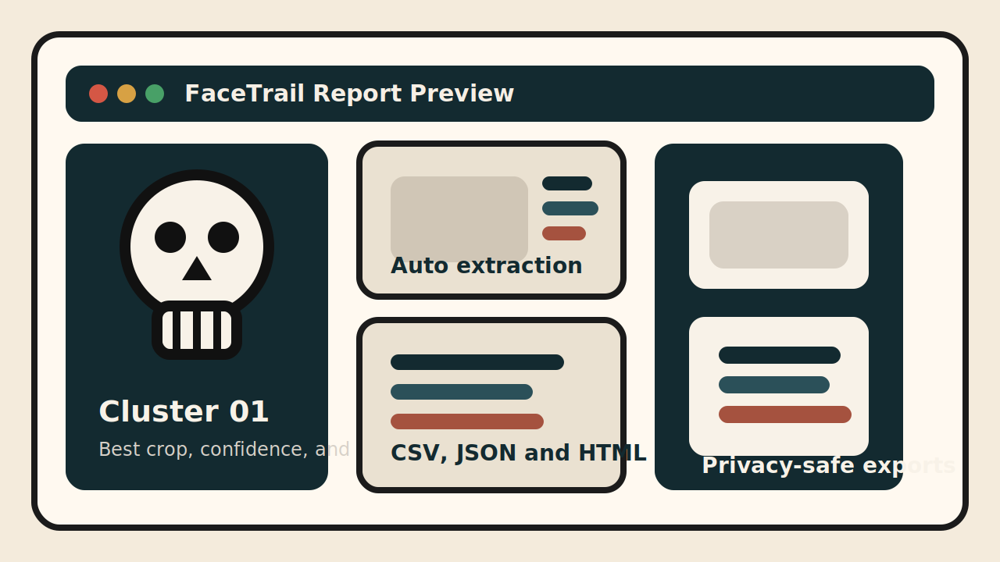

# FaceTrail



FaceTrail is a cross-platform CLI for face extraction, clustering, visual reports, and privacy-safe media exports. It turns a folder of images or videos into a practical review workspace, and it was rebuilt from the original `PythonFaceTracker` idea into something cleaner, easier to install, and actually ready to share.



## Why this is useful

- Review who appears across a media folder without manually scrubbing files.
- Keep the sharpest crop of each repeated face-like appearance.
- Generate HTML and JSON reports for audits, curation, or small local datasets.
- Produce redacted copies before sharing footage publicly.

## Features

- Works with single images, full folders, and videos.
- Uses OpenCV bundled Haar cascades automatically.
- Extracts face crops and scores sharpness.
- Clusters similar detections into reusable groups.
- Exports `gallery.html`, `summary.json`, and `detections.csv`.
- Saves blurred privacy-safe image or video copies when requested.

## Installation

Linux and macOS:

```bash
python -m venv .venv
source .venv/bin/activate
pip install -e .
```

Windows PowerShell:

```powershell
python -m venv .venv
.venv\Scripts\Activate.ps1
pip install -e .
```

## Release Packages

This repository now includes a release packer that always generates:

- `dist/facetrail-windows-vX.Y.Z.zip`
- `dist/facetrail-linux-vX.Y.Z.tar.gz`

Build them with:

```bash
python scripts/build_release.py
```

## Quick start

```bash
facetrail scan ./media --output ./output --save-redacted
```

Tune it for your library:

```bash
facetrail scan ./media --output ./output --sample-every 10 --min-face-size 96 --cluster-threshold 0.95 --save-redacted
```

## Output structure

- `output/faces/`: extracted face crops.
- `output/redacted/`: optional blurred image or video copies.
- `output/report/gallery.html`: visual review gallery.
- `output/report/summary.json`: machine-readable summary.
- `output/report/detections.csv`: spreadsheet-friendly manifest.

## Command reference

```text
facetrail scan INPUT [--output OUTPUT] [--sample-every N] [--min-face-size PX] [--cluster-threshold FLOAT] [--save-redacted]
```

Recommended defaults:

- `--sample-every 5` for balanced speed on videos.
- `--min-face-size 64` for everyday phone and webcam footage.
- `--cluster-threshold 0.92` for conservative grouping.

## Practical use cases

- Privacy pass before sending event footage to clients or friends.
- Media triage for creators, journalists, and researchers.
- Local photo review to find repeated people quickly.
- Lightweight preparation step before a more advanced vision pipeline.

## Limitations

- Clustering is appearance-based and lightweight. It is not a biometric identity system.
- Haar cascades are fast and portable, but they are not state-of-the-art detectors.
- Performance depends on lighting, face angle, and source quality.

---

# FaceTrail en Espanol


FaceTrail es una CLI multiplataforma para extraer rostros, agrupar apariciones similares, generar reportes visuales y exportar copias anonimizadas. Convierte una carpeta de imagenes o videos en un espacio de trabajo realmente util, y nace de la idea original de `PythonFaceTracker` pero rehecha para quedar mas limpia, portable y compartible.


## Que hace

- Escanea imagenes individuales, carpetas completas o videos.
- Detecta rostros con OpenCV sin pedir rutas manuales de cascadas.
- Extrae recortes automaticamente y agrupa apariciones parecidas.
- Calcula la mejor captura de cada grupo segun nitidez.
- Genera un reporte HTML, un `summary.json` y un `detections.csv`.
- Puede exportar copias anonimizadas con desenfoque facial.

## Instalacion

Linux:

```bash
python -m venv .venv
source .venv/bin/activate
pip install -e .
```

Windows PowerShell:

```powershell
python -m venv .venv
.venv\Scripts\Activate.ps1
pip install -e .
```

## Paquetes de Release

Este repositorio incluye un empaquetador que genera siempre:

- `dist/facetrail-windows-vX.Y.Z.zip`
- `dist/facetrail-linux-vX.Y.Z.tar.gz`

Se genera con:

```bash
python scripts/build_release.py
```

## Uso rapido

```bash
facetrail scan ./media --output ./output --save-redacted
```

Ajuste recomendado:

```bash
facetrail scan ./media --output ./output --sample-every 10 --min-face-size 96 --cluster-threshold 0.95 --save-redacted
```

## Estructura de salida

- `output/faces/`: recortes de rostros detectados.
- `output/redacted/`: copias opcionales con rostros difuminados.
- `output/report/gallery.html`: galeria visual.
- `output/report/summary.json`: resumen legible por maquinas.
- `output/report/detections.csv`: manifiesto facil de abrir en Excel o similares.

## Casos de uso

- Revisar rapidamente quien aparece en una carpeta audiovisual.
- Preparar material antes de compartirlo con privacidad basica.
- Curar lotes de fotos o videos para creadores, investigadores o prensa.
- Hacer una primera pasada ligera antes de un pipeline de vision mas complejo.

## Limitaciones

- El agrupamiento es ligero y basado en apariencia. No pretende ser biometria.
- Haar cascades prioriza portabilidad y facilidad, no el estado del arte.
- El rendimiento depende de iluminacion, angulo facial y calidad del material.

## Archivo adicional

La version separada en espanol se mantiene en [README.es.md](README.es.md).
